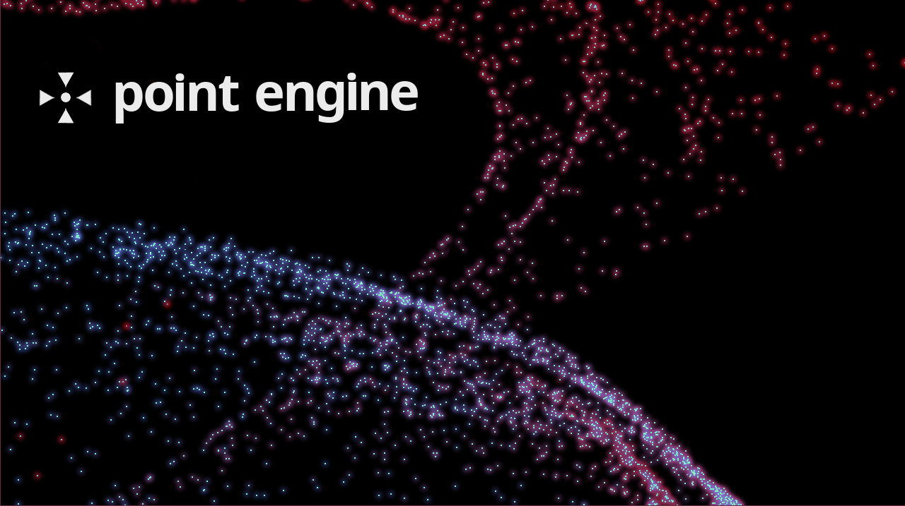
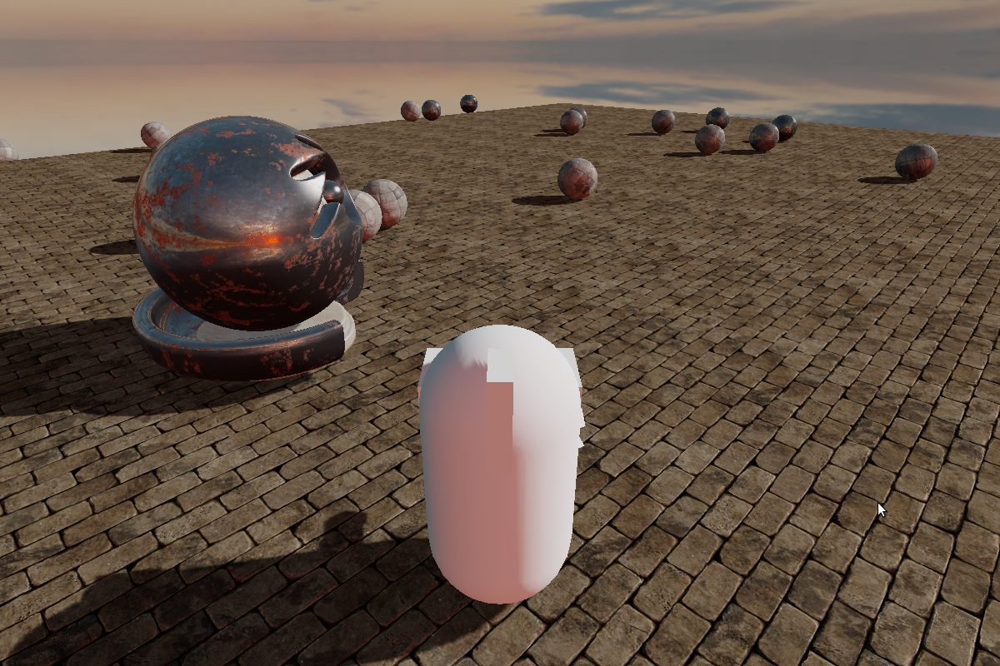
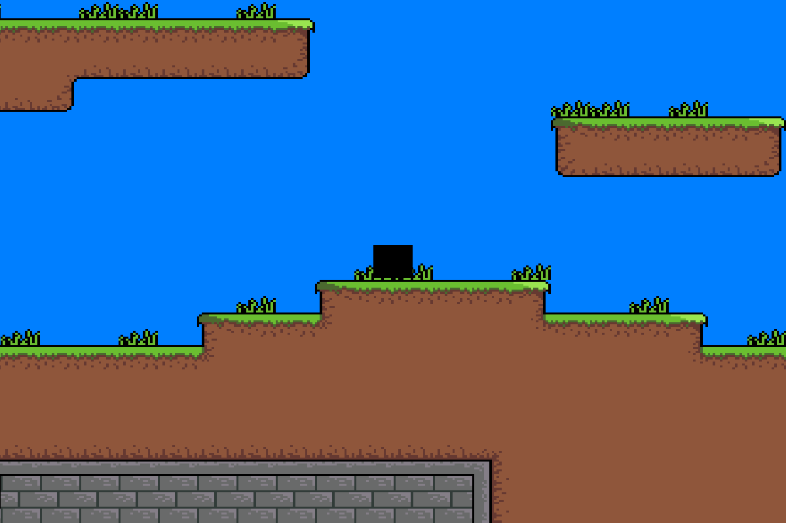

Point Engine is a lightweight game engine written in Java that runs off [LWJGL](http://www.lwjgl.org) aimed to help speed
up development with OpenGL by dealing with most of the boilerplate code and still
giving the programmer full access.

Some of the features of Point Engine are:

* 2D and 3D render pipelines.
* Support for PBR specular and metallic materials (though lighting isn't quite PBR yet).
* OBJ model importing.
* Scene system with GameObject rendering and updating.
* TTF font rendering.
* Vec2 Vec3 Vec4 and Mat4 classes designed to be as close as possible to GLSL.
* Resource management system to prevent game assets from ever being loaded from disk twice.
* Shadow map rendering system.
* Support for loading .tmx files from [Tiled](http://www.mapeditor.org/)
* [Bullet physics](https://github.com/nothings/stb) for 3D and [JBox2D](http://jbox2d.org/)for 2D with GameObject helper code to help simplify the libraries.

#### Examples

Each of these examples can be found in the [com.team.engine.demos](https://github.com/pianoman373/Game-Engine/tree/master/src/com/team/engine/demos) package of this repository.

Point Engine is licensed under the GPL, so feel free to use any of the code, or adapt it to your own needs.
